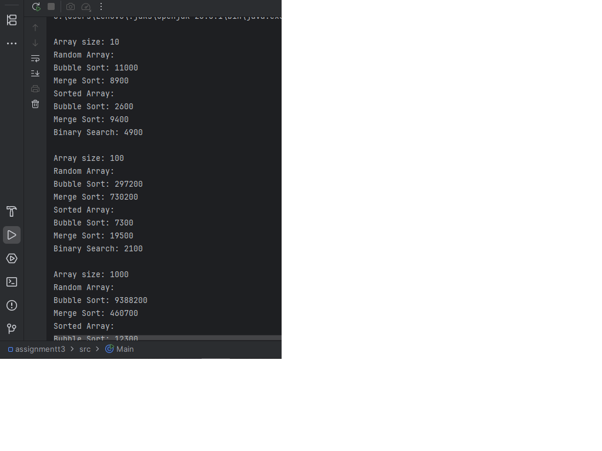
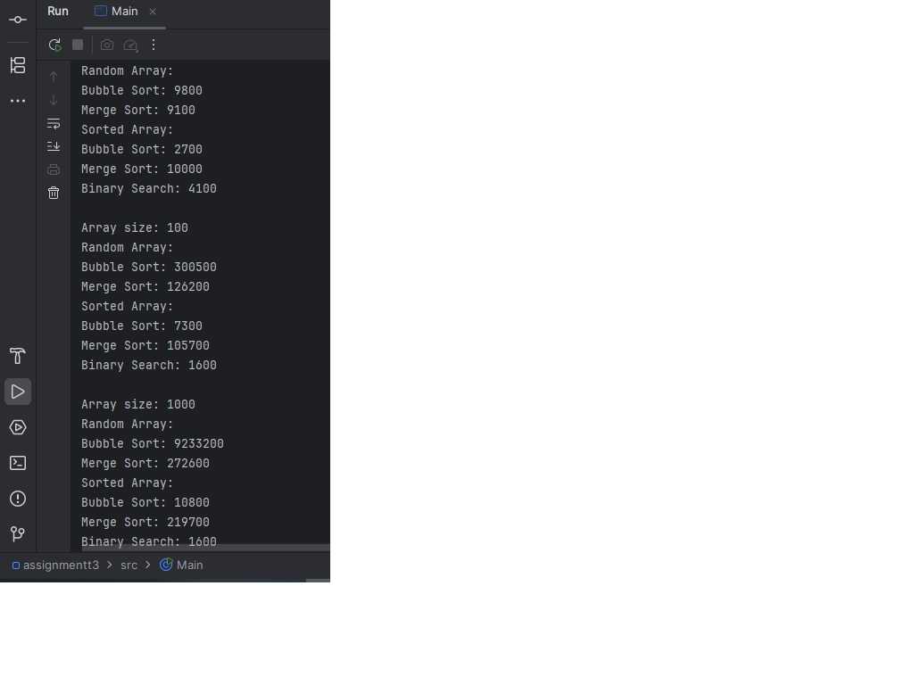

Assignment 3: Sorting and Searching Algorithm Analysis System

A. Project Overview

This project focuses on implementing and analyzing fundamental sorting and searching algorithms in Java. The goal is to compare their performance using execution time and evaluate how different input types affect efficiency.

Selected Algorithms:

1.Bubble Sort (Basic Sorting)

2.Merge Sort (Advanced Sorting)

3.Binary Search (Searching)

B. Algorithm Descriptions:

1. Bubble Sort

 - Bubble Sort repeatedly compares adjacent elements and swaps them if they are in the wrong order.

 - Time Complexity:

    -Worst case: O(n²)

    -Best case: O(n) (when already sorted)

 - Characteristics:
Simple but inefficient for large datasets
Performs better on already sorted arrays

2. Merge Sort

 - Merge Sort uses a divide-and-conquer approach by splitting the array into smaller parts and merging them in sorted order.

 - Time Complexity:

   -O(n log n) in all cases

 - Characteristics:
Efficient and stable
Performance does not depend on input order

3. Binary Search

 - Binary Search works by repeatedly dividing a sorted array in half to find a target value.

 - Time Complexity:

   -O(log n)

 - Requirement:
The array must be sorted

   
-Experimental Setup

The algorithms were tested using:

Array Sizes:

 - Small (10 elements)

 - Medium (100 elements)

 - Large (1000 elements)

Input Types:

 - Random arrays

 - Sorted arrays

Measurement Tool:

 - System.nanoTime() was used to calculate execution time

C. Experimental Results:

| Size | Input Type | Bubble Sort | Merge Sort | Binary Search |
|------|-----------|-------------|------------|---------------|
| 10   | Random    | 9800        | 9100       | -             |
| 10   | Sorted    | 2700        | 10000      | 4100          |
| 100  | Random    | 300500      | 126200     | -             |
| 100  | Sorted    | 7300        | 105700     | 1600          |
|1000  | Random    | 9233200     | 272600     | -             |
|1000  | Sorted    | 10800       | 219700     | 1600          | 

Analysis Questions:
1. Which sorting algorithm performed faster? Why?

Merge Sort performed significantly faster than Bubble Sort, especially on large arrays.
   This is because Merge Sort has a time complexity of O(n log n), while Bubble Sort has O(n²), making it much slower as the input size increases.

2. How does performance change with input size?

As the array size increases:
 - Bubble Sort becomes drastically slower due to quadratic growth
 - Merge Sort scales efficiently and handles large datasets well
 - Binary Search remains very fast regardless of size

3. How does sorted vs unsorted data affect performance?

 - Bubble Sort performs much faster on sorted arrays because it detects no swaps early
 - Merge Sort performance remains almost the same regardless of input
 - Binary Search requires sorted data to function

4. Do the results match the expected Big-O complexity?

Yes,the experimental results align with theoretical expectations:

 - Bubble Sort shows quadratic growth
 - Merge Sort shows logarithmic-linear behavior
 - Binary Search remains logarithmic

5. Which searching algorithm is more efficient? Why?

Binary Search is more efficient because it reduces the search space by half each step, resulting in O(log n) time complexity.

6. Why does Binary Search require a sorted array?

Binary Search relies on ordering to decide whether to search the left or right half of the array. Without sorting, it cannot determine the correct direction, making the algorithm invalid.

   
D. Screenshots:

E. Reflection section:

Through this assignment, I learned how different algorithms behave under various conditions and input sizes. It became clear that theoretical complexity directly impacts practical performance, especially for large datasets.

I also observed that some algorithms, like Bubble Sort, can perform well in specific cases, but are generally inefficient. Merge Sort proved to be reliable and scalable.

One of the challenges was ensuring accurate time measurement and properly structuring the program using object-oriented principles.